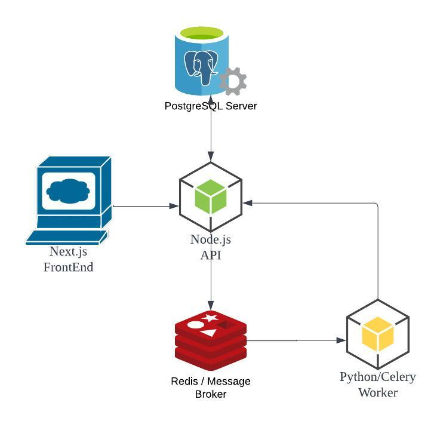

# Genre Finder

## A web app used to classify the musical genre of an audio file.

### Instructions to Run:
* docker-compose up
* open a browser and go to localhost:3000

### /api
* The backend API using Node.js, Express.js and Prisma.js.
* Used for JWT authentication, progress tracking for classification tasks and queuing classification tasks.
* Implements CLEAN architecture, adapted from: https://github.com/dev-mastery/comments-api

### /classifier
* The distributed task queue using Celery and Python.
* Used to classify the musical genre of an audio file by running a ML algorithm in a worker thread seperate from the api.
* Credit to the author of the LSTM classifier: https://github.com/ruohoruotsi/LSTM-Music-Genre-Classification

### /webapp
* A Front End using Next.js. 
* Allows a user register, upload audio and view the progress/result.
* Credit to the author of the UI Kit: https://github.com/creativetimofficial/nextjs-material-kit
